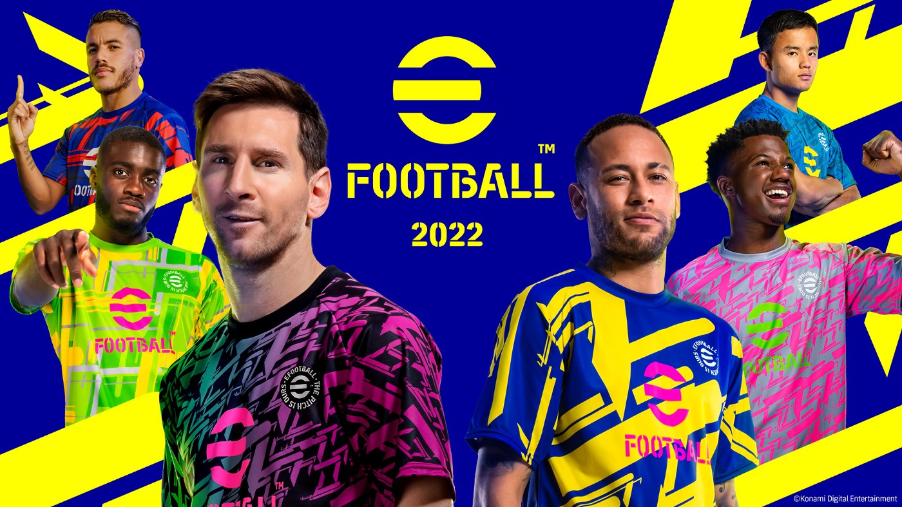
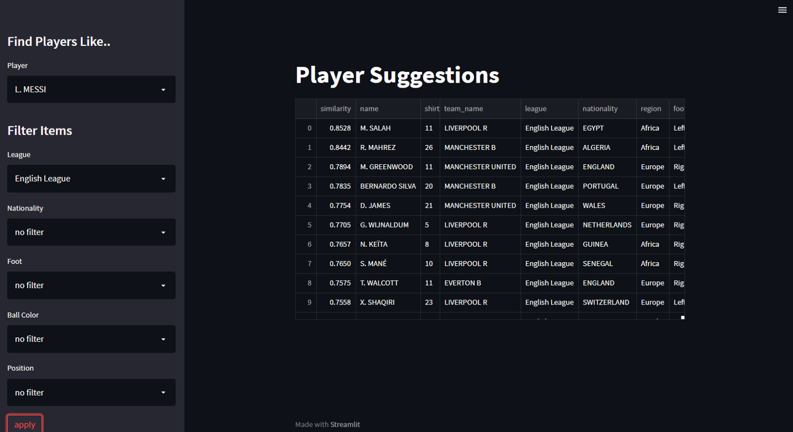

# Football Player Recommendation - From PES Data⚽️

## Intro
A player recommendation system build for replacing or filling player positions in a team

## Background
Often at the end of the season, some players leave, leaving managers in a position to replace their players. in contemporary football, we have seen some million-dollar flop transfers. Some managers are good at choosing players that fit their style and philosophy of playing but others might need some more experience. Which explains what makes a player fit in a team is not just a factor of the player’s attributes but something else that’s common to the entire team itself. a comparison could be modern-day premier league classic Man City vs Liverpool. Liverpool always has fast physical, attacking players but City has more technical players who can control, pass, and things, So how can we replace a player and don’t feel the loss at all? So I wanted to convert all of these available attributes into something that can measure a unique player’s role in a unique position in a unique team
The philosophy is to find the perfect replacement to fill the duties of a player, not a similar player. players who have been a part of a similar system are more likely to fill the part than finding the nearest neighbor using the original hundreds of features. This also decreases the computational expenses a lot. we could find a player based on similarity of the original features but they could have been a part of a different system that affects the adaptability of the player. So, we essentially are selecting players on basis of familiarity with the system. Hence adaptability.

## New Features
#### Team value: 
This feature uniquely identifies a single team. A team is a perfect balance of many features in many different ratios accessed through players. I made a normalized weighted sum of all the attributes to get this vector representing a team. with the weights being a feature called ‘ball color’ which represents how good a player is and it goes from 5–1 eg: Messi is a 5-tier player. more like a team’s-best representative are the best players
#### Positional Value:
A positional value has its value inside a team, nothing but the same normalizer weighted sum of all the players playing in a unique position in a team. now that’s a vector representing a unique position of a team
#### Player Value:
Player value is just the normalized vector of all the attributes of an individual player.

## Web app -filters

1. Get similar players choosing a  reference from "player" search field
2. Filter similar with league nationality,foot,ball colour, or position 
3. Access the web app here 👉: https://blessontomjoseph-pes-player-recommender-demo-app-htr28c.streamlitapp.com/

read more on the project: https://medium.com/@blessontomjoseph/football-player-recommendation-team-specific-95c4515598ee
